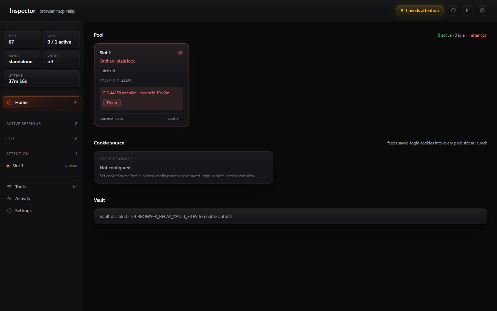
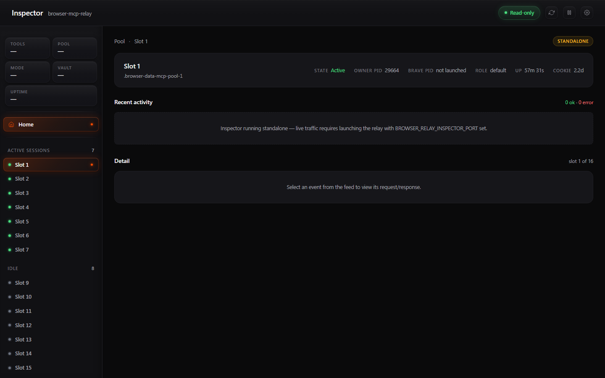
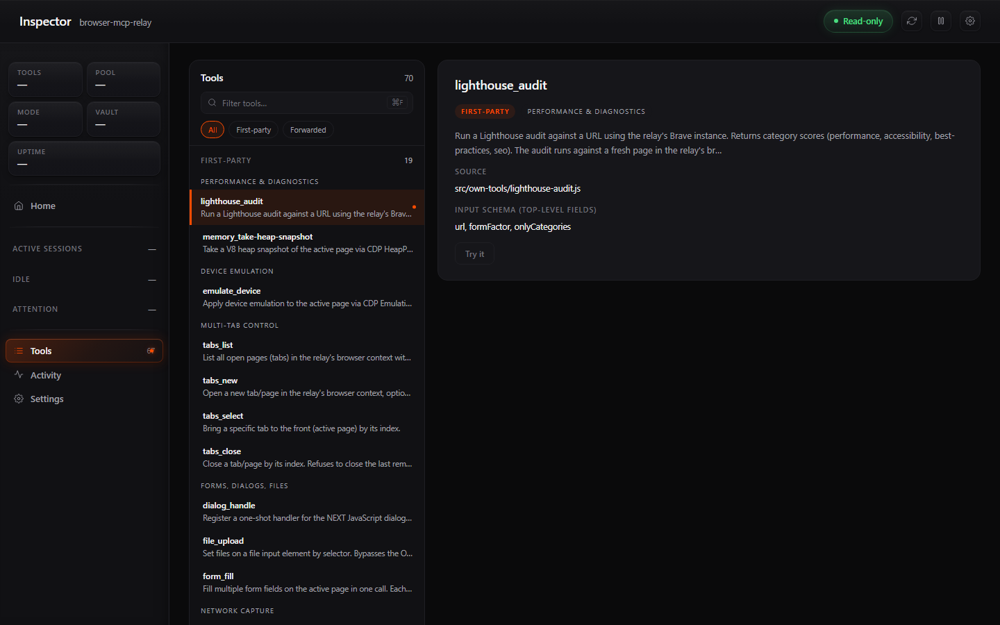
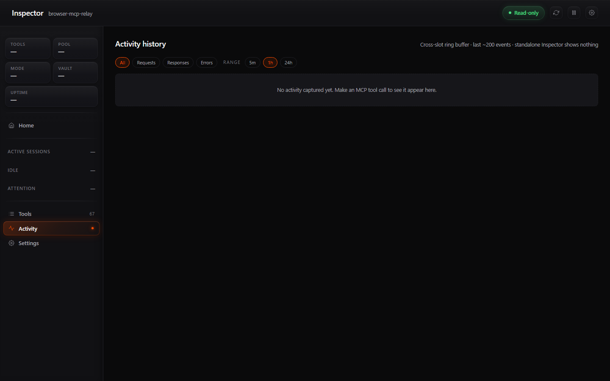
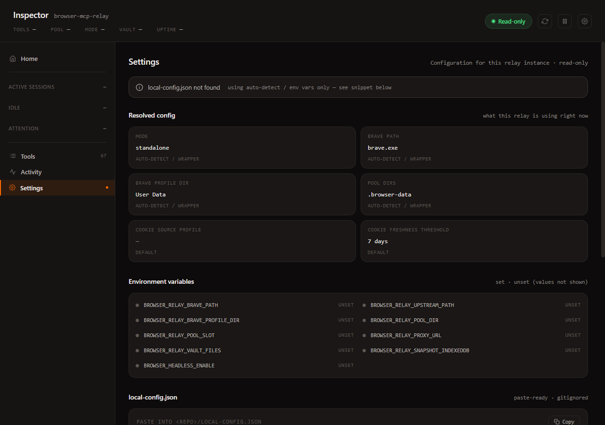

<div align="center">

# 🌉 browser-mcp-relay

**A Model Context Protocol (MCP) server that wraps [`browser-devtools-mcp`](https://github.com/serkan-ozal/browser-devtools-mcp) and adds 16 first-party browser tools — without forking the upstream.**

[](./LICENSE)
[](#)
[](#)
[](#tool-catalog)
[](#platform-support)
[](https://modelcontextprotocol.io/)

```
MCP client (Claude Code, Cursor) ── stdio ──▶ relay ──▶ upstream child + own-tools ──▶ Brave (1 per relay)
```

</div>

---

## 📑 Contents

- [In plain English](#-in-plain-english)
- [Overview](#-overview)
- [Highlights](#-highlights)
- [Quick start](#-quick-start)
- [Tool catalog](#%EF%B8%8F-tool-catalog)
- [Worked examples](#-worked-examples)
- [Architecture](#%EF%B8%8F-architecture)
- [Configuration](#%EF%B8%8F-configuration)
- [Modes](#-modes)
- [Optional features](#-optional-features)
- [Platform support](#%EF%B8%8F-platform-support)
- [Troubleshooting](#-troubleshooting)
- [Limitations](#%EF%B8%8F-limitations)
- [Contributing](#-contributing)
- [License](#-license)
- [Credits](#-credits)

---

## 🤔 In plain English

**This gives your AI assistant a real browser.**

When you ask Claude Code or Cursor to *"check what's on this page,"* *"fill out this form,"* *"run Lighthouse on production,"* or *"scrape my logged-in dashboard"* — the AI doesn't actually have a browser. It needs a tool that drives one for it.

`browser-mcp-relay` is that tool. It launches a real Brave browser on your computer, listens for instructions from your AI via the **Model Context Protocol** (MCP), and turns them into actual browser actions. Your AI gets ~67 commands ("tools") it can call; the relay does the work behind the scenes.

### What it lets your AI do

| | |
|---|---|
| 📸 **See pages** | Screenshots, full HTML, visible text, PDF export, ARIA tree, accessibility snapshots |
| 🖱️ **Click around** | Buttons, links, dropdowns, drag-and-drop, hover, scroll, keyboard input |
| 📝 **Fill forms** | Single fields or 20 at once via `form_fill`. File uploads without an OS picker. |
| 🔬 **Diagnose performance** | Lighthouse audits, Web Vitals (LCP/INP/CLS/TTFB/FCP), V8 heap snapshots |
| 📊 **Capture telemetry** | Console messages, HTTP requests, OpenTelemetry trace context, XHR/fetch responses |
| 🍪 **Reuse your sessions** | Saved cookies + (optionally) autofill credentials work, so logged-in pages just work |
| 🥷 **Stay stealthy** | Anti-bot patches that fool naive detection (`stealth_apply`) |
| 🔁 **Stub network calls** | Mock HTTP responses or intercept outgoing requests (`stub_*`) |
| ⚛️ **Inspect React** | Map React components ↔ DOM elements via Fiber |
| 💾 **Save outputs** | Capture downloads to disk, record video of the session, save heap snapshots |
| 🐛 **Live-debug** | Tracepoints, logpoints, exceptionpoints — non-pausing instrumentation |
| 🔍 **Extract structured data** | CSS-selector schema → JSON, even from authed pages |

### Why "relay"?

Because it bundles **two layers in one MCP server:**

- 🔁 **51 tools** from the open-source [`browser-devtools-mcp`](https://github.com/serkan-ozal/browser-devtools-mcp) project — forwarded verbatim
- 🌟 **16 tools** of our own — the things upstream doesn't ship (Lighthouse, cookies, device emulation, multi-tab, autofill, structured extraction, …)

Your AI sees **67 tools** total and doesn't know or care where each one comes from. To it, it's just one MCP.

### ✅ When to use it

- 🧪 End-to-end testing a site flow with real auth, real cookies, real JavaScript
- 🚦 Performance debugging after a deploy (Lighthouse, Web Vitals, HTTP traffic)
- 🔐 Scraping pages behind login — your saved Brave session works without re-authenticating
- 🕵️ Reverse-engineering a site's API — `capture_xhr` records every request while you click around
- 🧬 React component introspection during development
- 📡 API mocking — `stub_mock-http-response` lets you swap out a flaky upstream during testing

### ❌ When to use something else

- 🚫 **Headless mass scraping** → use [Firecrawl](https://firecrawl.dev/) or [Bright Data](https://brightdata.com/) — those are built for scale
- 🚫 **Plain unauthenticated HTTP fetches** → just use `curl` or your client's `WebFetch`
- 🚫 **Mobile / Safari / Firefox testing** → this is Brave/Chromium-only by design
- 🚫 **CI without a display** → works headlessly via `BROWSER_HEADLESS_ENABLE=true`, but you'll need a real X server or xvfb on Linux

### TL;DR

**Remote control for a real browser, with a vocabulary your AI already speaks.** Plug it into Claude Code, Cursor, or any MCP client; the AI gets 67 new things it can do.

---

## 🌐 Overview

`browser-mcp-relay` spawns [`browser-devtools-mcp`](https://github.com/serkan-ozal/browser-devtools-mcp) as a child process, forwards its **51 upstream tools** verbatim over JSON-RPC, and adds **16 first-party tools** of its own. Both layers attach to the *same* Brave browser instance over CDP, so the merged `tools/list` looks (to the MCP client) like one bigger MCP — **67 tools total**.

You add a tool by dropping a file in `src/own-tools/`. No upstream fork, no patch maintenance, no contribution-back blocker.

---

## ✨ Highlights

| | |
|---|---|
| 🧰 **Bigger toolbox** | 16 first-party tools beyond what upstream ships — Lighthouse, heap snapshots, device emulation, multi-tab, cookie export/import, structured extraction, and more. |
| 🪶 **Lazy backend** | Brave is launched on the *first* `tools/call`, not at startup. Idle MCP connections cost ~50 MB. |
| 🛡️ **Privacy-first** | Cookies, browsing data, and `local-config.json` never leave the machine. The relay does not phone home. |
| 🏠 **Own the surface** | Adding a tool is one new file + one registry entry. Friends fork freely; no upstream gatekeeping. |
| 🌍 **Cross-platform** | Auto-detects Brave + profile dir on Windows / macOS / Linux. Process management uses platform-native primitives. |
| 🤝 **Multi-session safe** | One Brave per relay process; opt-in pool mode for power users juggling multiple sessions. |

---

## 🚀 Quick start

```bash
git clone https://github.com/washedtl/browser-mcp-relay.git
cd browser-mcp-relay
npm install
npm run setup
```

The interactive setup wizard:

1. 🔍 Auto-detects your Brave install + profile dir + the upstream MCP
2. 📝 Writes `local-config.json` (gitignored — never committed)
3. 🧪 Runs a smoke test that spawns the relay + counts tools (expects ≥50)
4. 📋 Prints a paste-ready MCP registration snippet

Paste the printed snippet into the `mcpServers` section of your MCP client's config (e.g. `~/.claude.json` for Claude Code; `mcp.json` for Cursor) and restart the client. **The whole thing takes under two minutes on a clean machine.**

> 💡 The wizard **never** modifies your client's config file directly — it only prints a snippet. You stay in control of where it lands.

To re-verify the relay anytime:

```bash
npm run smoke
# → ✓ Relay healthy. 67 tools available (≥50). 2.4s
```

---

## 🛠️ Tool catalog

**67 tools total = 16 first-party (built into this relay) + 51 forwarded from [`browser-devtools-mcp`](https://github.com/serkan-ozal/browser-devtools-mcp).**

Both layers are merged into a single `tools/list` response, so to your MCP client they all just look like "tools the relay provides."

### 🌟 First-party tools (16)

##### 🔬 Performance & diagnostics

| Tool | Purpose | Notable arg | Example use case |
|---|---|---|---|
| `lighthouse_audit` | Lighthouse audit against a URL | `formFactor: "desktop"\|"mobile"` | Performance regression check on a deploy |
| `memory_take-heap-snapshot` | V8 heap snapshot via CDP | `outputPath` | Memory-leak hunt on a long-running SPA |

#### 📱 Device emulation

| Tool | Purpose | Notable arg | Example use case |
|---|---|---|---|
| `emulate_device` | UA / viewport / network throttling | `network.downloadKbps` | Verify a layout on Slow 3G |

#### 📑 Multi-tab control

| Tool | Purpose | Notable arg | Example use case |
|---|---|---|---|
| `tabs_list` | List open tabs by index + URL | — | "Where did I leave that page?" |
| `tabs_new` | Open a new tab | `url` | Spawn a side-panel comparison |
| `tabs_select` | Bring a tab to front | `index` | Switch to a specific tab before interacting |
| `tabs_close` | Close a tab by index | `index` | Tear down workflow tabs |

#### 📤 Forms, dialogs, files

| Tool | Purpose | Notable arg | Example use case |
|---|---|---|---|
| `dialog_handle` | Auto-handle the next JS dialog | `action: "accept"\|"dismiss"` | Click a button that triggers `confirm()` |
| `file_upload` | Set files on a file input | `files: [absPath]` | Upload a file without an OS picker |
| `form_fill` | Fill many fields in one round-trip | `fields: [{selector, value}]` | Bulk-fill a long signup form |

#### 🌐 Network capture

| Tool | Purpose | Notable arg | Example use case |
|---|---|---|---|
| `capture_xhr` | Record XHR/fetch responses | `urlFilter` (regex) | Reverse-engineer a site API while logged in |

#### 🍪 Session & cookies

| Tool | Purpose | Notable arg | Example use case |
|---|---|---|---|
| `cookies_export` | Export cookies as JSON | `urls` (filter) | Save an authed session for later |
| `cookies_import` | Import cookies into the context | `cookies` | Restore an authed session |
| `stealth_apply` | Anti-detection patches | `languages` | Defeat trivial bot checks |

#### 💾 Downloads

| Tool | Purpose | Notable arg | Example use case |
|---|---|---|---|
| `download_capture` | Wait for a download, save to disk | `clickSelector` | Trigger + save a CSV export |

#### 🔍 Data extraction

| Tool | Purpose | Notable arg | Example use case |
|---|---|---|---|
| `extract_structured` | CSS-selector-based extraction | `schema` | Scrape an authed page that firecrawl can't reach |

> Source for each first-party tool lives at [`src/own-tools/<tool-name>.js`](./src/own-tools/).

---

### 🔁 Forwarded upstream tools (51)

Provided by [`browser-devtools-mcp`](https://github.com/serkan-ozal/browser-devtools-mcp) — the relay forwards `tools/call` requests for these to the upstream child process verbatim. Brief summaries below; full schemas come straight from upstream and are visible to your MCP client via `tools/list`.

#### ♿ Accessibility (2)

| Tool | Purpose |
|---|---|
| `a11y_take-aria-snapshot` | ARIA tree snapshot with refs (`e1`, `e2`, …) for downstream targeting |
| `a11y_take-ax-tree-snapshot` | Chromium AX tree + bounding boxes / visibility / viewport diagnostics |

#### 📄 Content extraction & capture (6)

| Tool | Purpose |
|---|---|
| `content_get-as-html` | Get the page's HTML |
| `content_get-as-text` | Get the page's visible text |
| `content_save-as-pdf` | Save current page as a PDF |
| `content_take-screenshot` | Screenshot the page or a specific element |
| `content_start-recording` | Start video recording |
| `content_stop-recording` | Stop recording and save the video file |

#### 🐛 Live debugging probes (11)

| Tool | Purpose |
|---|---|
| `debug_status` | Status of the debug subsystem |
| `debug_resolve-source-location` | Resolve a source-map location |
| `debug_put-tracepoint` | Install a tracepoint at a source location |
| `debug_put-logpoint` | Install a logpoint (non-pausing console-style log) |
| `debug_put-exceptionpoint` | Install an exception breakpoint |
| `debug_add-watch` | Add a watch expression evaluated on each probe hit |
| `debug_list-probes` | List installed tracepoints / logpoints / watches |
| `debug_remove-probe` | Remove a probe by ID |
| `debug_clear-probes` | Bulk-remove probes by type |
| `debug_get-probe-snapshots` | Get captured snapshots from probes |
| `debug_clear-probe-snapshots` | Clear captured snapshots |

#### 🖱️ Page interaction (9)

| Tool | Purpose |
|---|---|
| `interaction_click` | Click an element (selector or ARIA ref) |
| `interaction_fill` | Fill an input |
| `interaction_select` | Select a dropdown option |
| `interaction_hover` | Hover an element |
| `interaction_drag` | Drag an element to a target |
| `interaction_press-key` | Press a keyboard key (with optional hold + repeat) |
| `interaction_scroll` | Scroll the viewport or a scrollable element |
| `interaction_resize-viewport` | Resize the page viewport (Playwright emulation) |
| `interaction_resize-window` | Resize the OS-level browser window via CDP |

#### 🧭 Navigation (3)

| Tool | Purpose |
|---|---|
| `navigation_go-to` | Navigate to a URL |
| `navigation_reload` | Reload the current page |
| `navigation_go-back-or-forward` | Move through history |

#### 📈 Observability (6)

| Tool | Purpose |
|---|---|
| `o11y_get-console-messages` | Console messages / logs with filtering |
| `o11y_get-http-requests` | HTTP requests with filtering |
| `o11y_get-web-vitals` | LCP / INP / CLS / TTFB / FCP with Google thresholds |
| `o11y_get-trace-context` | Get the OpenTelemetry trace context |
| `o11y_set-trace-context` | Set or clear the OTel trace context |
| `o11y_new-trace-id` | Generate + set a new OTel trace ID |

#### ⚛️ React introspection (2)

| Tool | Purpose |
|---|---|
| `react_get-component-for-element` | Find React component(s) for a DOM element via Fiber |
| `react_get-element-for-component` | Map a React component instance to its DOM footprint |

#### 🔌 HTTP stubbing (4)

| Tool | Purpose |
|---|---|
| `stub_intercept-http-request` | Modify outgoing requests before they're sent |
| `stub_mock-http-response` | Mock responses for matching requests (picomatch glob) |
| `stub_list` | List currently installed stubs |
| `stub_clear` | Clear all stubs |

#### 🎬 Scenarios (6)

| Tool | Purpose |
|---|---|
| `scenario-add` | Save a reusable JS script that orchestrates other tools |
| `scenario-update` | Update a scenario's description / script |
| `scenario-delete` | Delete a scenario by name |
| `scenario-run` | Run a saved scenario by name |
| `scenario-list` | List all scenarios (project + global scope) |
| `scenario-search` | Search scenarios by query |

#### ⚡ Other (2)

| Tool | Purpose |
|---|---|
| `execute` | Batch-execute multiple tool calls in one request via custom JS — reduces round-trips |
| `sync_wait-for-network-idle` | Wait until in-flight requests ≤ N for `idleMs` |

---

## 💡 Worked examples

Each example shows the raw JSON-RPC `tools/call` request your MCP client would send. Most clients (Claude Code, Cursor) wrap this in a higher-level "use tool X" UX — these payloads are useful when you're debugging or building your own client.

### 🔬 `lighthouse_audit` — measure performance after a deploy

```jsonc
// Request
{
  "jsonrpc": "2.0",
  "id": 7,
  "method": "tools/call",
  "params": {
    "name": "lighthouse_audit",
    "arguments": {
      "url": "https://example.com",
      "formFactor": "desktop"
    }
  }
}
```

```jsonc
// Response (truncated)
{
  "jsonrpc": "2.0",
  "id": 7,
  "result": {
    "content": [{
      "type": "text",
      "text": "{\n  \"url\": \"https://example.com\",\n  \"formFactor\": \"desktop\",\n  \"scores\": {\n    \"performance\": 0.99,\n    \"accessibility\": 0.92,\n    \"best-practices\": 1.0,\n    \"seo\": 0.91\n  }\n}"
    }]
  }
}
```

> Use it in CI to fail a deploy when Lighthouse drops below a threshold, or interactively when you want a one-line "is this page slow?" answer.

### 🍪 `cookies_export` — save an authed session

```jsonc
// Request — capture only cookies that apply to amazon.com
{
  "jsonrpc": "2.0",
  "id": 8,
  "method": "tools/call",
  "params": {
    "name": "cookies_export",
    "arguments": {
      "urls": ["https://www.amazon.com/"]
    }
  }
}
```

```jsonc
// Response (truncated)
{
  "result": {
    "content": [{
      "type": "text",
      "text": "[\n  { \"name\": \"session-id\", \"value\": \"<...>\", \"domain\": \".amazon.com\", \"path\": \"/\", \"httpOnly\": true, \"secure\": true, \"sameSite\": \"Lax\" },\n  { \"name\": \"ubid-main\", \"value\": \"<...>\", \"domain\": \".amazon.com\", ... }\n]"
    }]
  }
}
```

> Pair with `cookies_import` to restore the session later — useful for testing multi-step authed flows without re-logging in each run.

### 🔍 `extract_structured` — scrape an authed page

```jsonc
// Request
{
  "jsonrpc": "2.0",
  "id": 9,
  "method": "tools/call",
  "params": {
    "name": "extract_structured",
    "arguments": {
      "navigateToUrl": "https://example.com/product/123",
      "waitForSelector": "#productTitle",
      "schema": {
        "title":  { "selector": "#productTitle" },
        "price":  { "selector": "#priceblock" },
        "images": { "selector": "img.thumb", "attribute": "src", "multiple": true }
      }
    }
  }
}
```

```jsonc
// Response
{
  "result": {
    "content": [{
      "type": "text",
      "text": "{\n  \"title\": \"Example Product\",\n  \"price\": \"$19.99\",\n  \"images\": [\"https://.../1.jpg\", \"https://.../2.jpg\"]\n}"
    }]
  }
}
```

> Use this when a page is behind a login or a captcha that public scrapers can't bypass — your relay's Brave is already authenticated.

---

## 🏗️ Architecture

```
                    stdio JSON-RPC
   MCP client ───────────────────▶  browser-mcp-relay
   (Claude Code,                    (this repo)
    Cursor, …)                              │
                                            ├── stdio JSON-RPC
                                            ▼
                                    browser-devtools-mcp
                                       (upstream child)
                                            │
                                            │ CDP
                                            ▼
                                       ┌─────────┐
                                       │  Brave  │   ◀── one per relay process
                                       │ (one    │       (lazy: launched on
                                       │  per    │        first tools/call)
                                       │  relay) │
                                       └─────────┘
                                            ▲
                                            │ CDP (Playwright connectOverCDP)
                                            │
                                       relay's own-tools
                                       (this repo, 16 tools)
```

**How it works:**

- 📥 The relay receives MCP messages on stdin from your client.
- 📋 `tools/list` → merges the upstream's catalog with the 16 own-tool definitions and returns one combined list.
- ⚙️ `tools/call` → either forwards to the upstream child (for the 51 forwarded tools) or runs an own-tool handler directly.
- 🔌 Both paths attach to the same Brave instance: the upstream uses `BROWSER_CDP_CONNECT_URL`, own-tools use Playwright's `chromium.connectOverCDP` against the same port.
- 🪶 One Brave per relay process. Brave is launched **lazily on the first `tools/call`**, not at startup.

---

## ⚙️ Configuration

All paths the relay needs are auto-detected by default. Override them with these env vars or by editing `local-config.json` (gitignored, written by `npm run setup`).

| Env var | Default | Purpose |
|---|---|---|
| `BROWSER_RELAY_BRAVE_PATH` | auto-detect | Absolute path to `brave` / `brave.exe`. Auto-detect probes standard install locations on Win/Mac/Linux + the Windows registry. |
| `BROWSER_RELAY_UPSTREAM_PATH` | `require.resolve("browser-devtools-mcp/dist/index.js")` | Path to the upstream `browser-devtools-mcp` entry. Override to point at a custom build. |
| `BROWSER_RELAY_BRAVE_PROFILE_DIR` | unset | Optional profile dir hint used by detection / cookie snapshot. |
| `BROWSER_RELAY_POOL_DIR` | unset (standalone) | Opt-in: absolute path to a Brave user-data-dir to claim. Standalone mode uses `<repo>/.browser-data`. |
| `BROWSER_RELAY_POOL_SLOT` | unset | Cosmetic slot index for the launch banner; also sets the CDP port (`9333 + slot - 1`) when using pool mode. |
| `BROWSER_HEADLESS_ENABLE` | `false` | Set `true` to launch Brave headless. |
| `BROWSER_LOAD_EXTENSIONS` | unset | Path to an unpacked Chrome extension to load. |
| `BROWSER_MCP_ROLE` | unset | Role-based slot filter (only meaningful with the optional pool wrapper). |
| `BROWSER_RELAY_PROXY_URL` | unset | Optional HTTP proxy for Brave's outbound traffic. Useful with debug proxies (Charles, mitmproxy, powhttp). See [Optional features](#-optional-features). |
| `BROWSER_RELAY_VAULT_FILES` | unset (autofill disabled) | Semicolon-separated paths to Brave/Chrome password CSV exports. Enables form-autofill on navigation. See [Optional features](#-optional-features). |
| `BROWSER_RELAY_SNAPSHOT_INDEXEDDB` | `false` | Include IndexedDB in pool-mode profile snapshot (100+ MB typical). |
| `BROWSER_RELAY_INSPECTOR_PORT` | unset | When set, the relay boots the Inspector dashboard inline on this port and pipes its live MCP-traffic stream into the `/slot/N` Inspector pages. Without this, run the Inspector separately via `npm run inspector` (no live traffic). See [Live inspector](#-live-inspector). |
| `BROWSER_RELAY_INSPECTOR_BIND` | `127.0.0.1` | Bind address for the Inspector. Override only with care — the Inspector has no auth. |

**Precedence:** environment variable ▸ `local-config.json` ▸ auto-detect ▸ reasonable hard-coded defaults.

---

## 🔀 Modes

### 🟢 Standalone (default)

One Brave per relay process, profile stored at `<repo>/.browser-data`. No cookie snapshot. Each `npm run setup` produces this configuration. **Recommended for first-time users.**

### 🔵 Pool (opt-in)

Set `BROWSER_RELAY_POOL_DIR` to an absolute path of a Brave user-data-dir to claim. Pool mode uses that single dir + the slot index from `BROWSER_RELAY_POOL_SLOT` for the launch banner + CDP port (`9333 + slot - 1`). **Useful when running multiple relay processes against pre-warmed Brave profiles** — each relay claims a different dir, each gets a deterministic port.

---

## 🔓 Optional features

### 🌐 Proxy whitelist

Set `BROWSER_RELAY_PROXY_URL=http://127.0.0.1:8888` (or wherever your debug proxy listens) to route the relay's Brave traffic through an HTTP proxy you control. Combined with the relay's per-context `ignoreHTTPSErrors`, this lets you inspect the relay's HTTP traffic via Charles, mitmproxy, powhttp, etc. without affecting your main browser. Your system proxy stays untouched — only this launched Brave opts in.

> ⚠️ **Security:** Only point this at HTTP proxies you control on **localhost**. The relay accepts any TLS cert when a proxy is set (so MITM debug proxies "just work"), which means a hostile or compromised remote proxy can transparently MITM all of the relay's traffic — including pages you're authenticated to. If you don't fully control the proxy, leave this unset.

### 🔐 Credential vault + autofill

The relay can auto-fill login forms when a saved credential matches the current page's hostname. **Off by default.** To enable:

1. Export passwords from Brave (or Chrome): `brave://settings/passwords` → "Export passwords" → save as CSV
2. Set `BROWSER_RELAY_VAULT_FILES=/absolute/path/to/passwords.csv` (semicolon-separate multiple paths)
3. Restart the relay

The vault loads CSVs at startup, indexes by hostname + registrable domain, and fills the first empty username + password fields on each `framenavigated`. **It does not auto-submit** — you click submit yourself.

> ⚠️ **Security:** Passwords stay in memory only — never logged, never re-written. But anyone with read access to your relay process's memory could read them. Only point this at CSVs you trust. The vault is most useful when scraping authed sites that block Playwright's password manager (e.g. Brave 127+'s App-Bound Encryption).

### 🔍 Live inspector

A small web dashboard for peeking at the relay's runtime state — pool slot status (claimed / idle / orphan), cookie-source freshness, vault entry counts, tool counts, uptime, plus a per-slot **Inspector page** with live MCP-traffic streaming. **Off by default**, no auth, read-only.



Two modes:

#### Standalone (no live traffic)

Start the Inspector separately. It still serves Pool / Tools / Activity / Settings / per-slot pages, but the **Activity feed on `/slot/N` will be empty** — there's no relay process to subscribe to.

```bash
npm run inspector
# Inspector running at http://127.0.0.1:9090
```

#### In-process (full live traffic)

Set `BROWSER_RELAY_INSPECTOR_PORT` in your MCP-client config (e.g. `~/.claude.json`) so the relay boots the Inspector inline. The Inspector then subscribes to the relay's traffic emitter and streams every `tools/call` request + response over a WebSocket to connected Inspector tabs.

```jsonc
// ~/.claude.json (excerpt)
{
  "mcpServers": {
    "browser-mcp-relay": {
      "command": "node",
      "args": ["<absolute-path-to-repo>/src/index.js"],
      "env": {
        "BROWSER_RELAY_INSPECTOR_PORT": "9091"
      }
    }
  }
}
```

After the next MCP connect, open `http://localhost:9091/slot/1` to see the per-slot Inspector page. The Activity feed populates in real time as your AI client makes tool calls.

#### Pages

The Inspector has five surfaces:

| | |
|---|---|
| **Pool overview** (`/`) — slot grid (claimed / idle / orphan), cookie-source freshness card, vault summary. Orphan slots get a **Reap** button that clears the stale lock + kills any leftover Brave processes holding that user-data-dir. |  |
| **Slot detail** (`/slot/N`) — per-slot live activity feed (request → response cards, last 100), click any event to see request JSON + response + timing in the Detail card. Empty in standalone mode; live in in-process mode. |  |
| **Tools catalog** (`/tools`) — all 67 tools (16 first-party + 51 forwarded), filter + per-tool detail |  |
| **Activity history** (`/activity`) — cross-slot ring buffer of the last ~200 MCP tool calls, with filter pills (All / Requests / Responses / Errors) and time-range picker (5m / 1h / 24h). Empty in standalone mode. |  |
| **Settings** (`/settings`) — resolved config, env-var booleans, paste-ready `local-config.json` snippet |  |

The only mutating endpoint (`POST /api/slots/N/reap`) requires a same-origin Origin header (or no Origin — the curl path); cross-origin POSTs are rejected with 403.

> ⚠️ **Security:** The inspector binds to **`127.0.0.1` only by default** and has **no authentication**. Only the local user can reach it. Anyone with shell access to your machine — or any process running locally — can read pool state, vault file paths, and tool counts. The WebSocket streams every `tools/call` request + response; in-process mode means *anyone with localhost access can see what your AI is doing in real time*. **Treat the inspector port as if it had your bearer tokens on it** — `tools/call` arguments routinely contain auth tokens, URLs of authed sessions, the cookies your AI is sending, etc. Don't expose it via SSH tunnels, ngrok, or `BROWSER_RELAY_INSPECTOR_BIND=0.0.0.0` unless you know what you're doing. **Kill the server when you're done** (Ctrl+C). Defenses in place: localhost-only bind, Origin allowlist on the WS upgrade and on every mutating POST, `X-Frame-Options: DENY` + `frame-ancestors 'none'` (clickjacking gate), `Cache-Control: no-store` on every API response, path-traversal hard stop, 64 KB WS frame cap + 1 MB back-pressure cap.

---

## 🖥️ Platform support

| Platform | Status | Notes |
|---|---|---|
| 🪟 **Windows** | ✅ First-class | Tested daily. PowerShell + registry probes for Brave detection. |
| 🍎 **macOS** | 🟡 Best-effort | Code paths are written portably (`process-shim.js`, `detect-browser.js`) but not yet maintainer-verified. Bug reports welcome. |
| 🐧 **Linux** | 🟡 Best-effort | Honors `XDG_CONFIG_HOME` for Brave profile detection. POSIX `kill -0` for liveness. Not yet maintainer-verified end-to-end. |

---

## 🔧 Troubleshooting

### "Brave not found"

Auto-detect couldn't find Brave at any of the standard locations. Either:

- Install Brave from [brave.com](https://brave.com/), OR
- Set `BROWSER_RELAY_BRAVE_PATH=/absolute/path/to/brave` and re-run `npm run setup`

### "Cannot find module 'browser-devtools-mcp'"

The upstream MCP isn't installed. Run:

```bash
npm install
```

…or, if you want a custom upstream build, set `BROWSER_RELAY_UPSTREAM_PATH=/absolute/path/to/dist/index.js` and re-run setup.

### Smoke test fails: "tool count too low"

The relay started but returned fewer than 50 tools. Check the relay's stderr output for upstream-spawn errors, or the smoke script's stderr tail.

### "Tools appear in `tools/list` but `tools/call` hangs"

Brave didn't launch successfully. Common causes: another Brave instance holding the user-data-dir lock, missing display server (Linux headless without xvfb), or insufficient permissions. Try `BROWSER_HEADLESS_ENABLE=true`.

### Multiple relays from one machine

Each relay process needs its own user-data-dir. Use pool mode (`BROWSER_RELAY_POOL_DIR=/path/to/dir`, different per process) or run each relay in its own checkout.

---

## ⚠️ Limitations

- 📜 Upstream `browser-devtools-mcp` is licensed **Elastic-2.0** — permissive but **not OSI-approved-open-source**. See [`THIRD_PARTY_NOTICES.md`](./THIRD_PARTY_NOTICES.md) for the full breakdown.
- 🦁 Requires **Brave** installed locally. Other Chromium browsers may work via `BROWSER_RELAY_BRAVE_PATH` but are untested.
- 🍪 **Standalone mode does not snapshot cookies** from another profile — first run hits login walls. Cookie snapshot is a pool-mode feature.
- 🧍 **One Brave per relay process.** To run multiple Brave sessions in parallel, run multiple relays (each on its own slot / profile dir).
- 🔐 **3 low-severity transitive `cookie<0.7.0` advisories** via `lighthouse → @sentry/node`. Fix requires `lighthouse@13`, which is a breaking dep upgrade for our `^11.0.0` pin. Tracked; not exploitable in practice for a localhost-bound dev tool. Run `npm audit` to see them; `npm audit fix --force` would resolve at the cost of a major-version upgrade.

---

## 🤝 Contributing

Bug reports and PRs welcome! See [`CONTRIBUTING.md`](./CONTRIBUTING.md) for:

- 🗺️ Quick orientation tour of the codebase
- ⚡ The "add an own-tool in 5 minutes" walkthrough
- 🎨 Code-style notes (CommonJS, no TypeScript, JSDoc for public APIs)
- 🧪 Test conventions and the test-seam pattern

---

## 📄 License

MIT — see [`LICENSE`](./LICENSE).

Direct-dependency licenses, including the Elastic-2.0 callout for the upstream `browser-devtools-mcp`, are documented in [`THIRD_PARTY_NOTICES.md`](./THIRD_PARTY_NOTICES.md).

---

## 🙏 Credits

Built on top of [`browser-devtools-mcp`](https://github.com/serkan-ozal/browser-devtools-mcp) by **Serkan Ozal**. The upstream provides the 51 forwarded tools that make this relay useful out of the box.

The MCP protocol itself is defined by Anthropic — see [modelcontextprotocol.io](https://modelcontextprotocol.io/).

---

<div align="center">

**Found a bug? [Open an issue](https://github.com/washedtl/browser-mcp-relay/issues).**
**Want to add a tool? [Read CONTRIBUTING.md](./CONTRIBUTING.md).**

</div>
