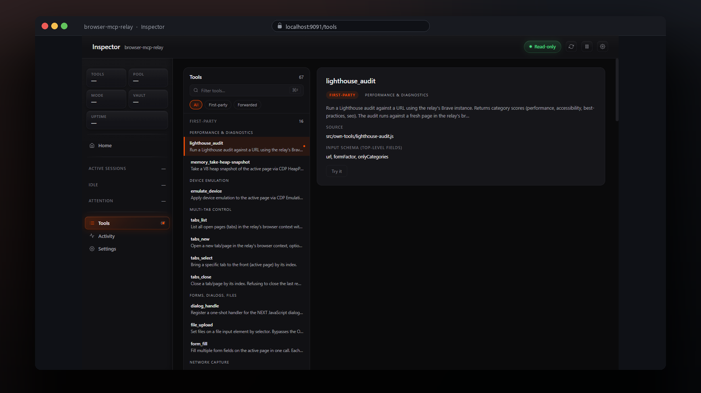

<div align="center">



# browser-mcp-relay

**Give your AI a real browser.**

[](./LICENSE)
[](#)
[](#)
[](docs/REFERENCE.md#tool-catalog)
[](docs/REFERENCE.md#platform-support)

</div>

---

## What this is

When you ask Claude or Cursor to *"check what's on this page"*, *"fill out this form"*, or *"run Lighthouse on production"* — your AI doesn't actually have a browser. It needs a tool that drives one.

`browser-mcp-relay` is that tool. It launches a real Brave browser on your computer, listens for instructions from your AI via the [Model Context Protocol](https://modelcontextprotocol.io/), and turns them into actual browser actions. Your AI gets **70 commands** ("tools") it can call; the relay does the work behind the scenes.

## What you can ask your AI to do

| | |
|---|---|
| 📸 **See pages** | Screenshots, full HTML, visible text, PDF export, ARIA tree |
| 🖱️ **Click around** | Buttons, links, dropdowns, drag-and-drop, hover, scroll, type |
| 📝 **Fill forms** | Single fields or 20 at once. File uploads with no OS picker. |
| 🔬 **Measure performance** | Lighthouse audits, Web Vitals, V8 heap snapshots |
| 📊 **Capture traffic** | Console logs, HTTP requests, XHR/fetch responses |
| 🍪 **Reuse your sessions** | Saved cookies + optional autofill, so logged-in pages just work |
| 💾 **Save outputs** | Capture downloads, record video, save heap snapshots |
| 🔍 **Extract data** | CSS-selector schema → JSON, even from authed pages |

For the full 70-tool catalog, see [`docs/REFERENCE.md`](docs/REFERENCE.md).

## Quick start

```bash
git clone https://github.com/washedtl/browser-mcp-relay.git
cd browser-mcp-relay
npm install
npm run setup
```

The setup wizard:

1. Auto-detects your Brave install + profile dir
2. Writes a gitignored `local-config.json`
3. Runs a smoke test (spawns the relay, expects ≥60 tools)
4. Prints a paste-ready snippet for your MCP client config

Paste the printed snippet into your MCP client's config file (`~/.claude.json` for Claude Code; `mcp.json` for Cursor) and restart the client. **Under two minutes on a clean machine.**

> 💡 The wizard never modifies your client's config directly — it only prints a snippet. You stay in control of where it lands.

To re-verify anytime:

```bash
npm run smoke
# → ✓ Relay healthy. 70 tools available (≥60). 3.2s
```

## The Inspector

Optional read-only web UI at `localhost:9091` showing the live state of pool slots, the tool catalog, and a real-time feed of every `tools/call` your AI makes.

```bash
npm run inspector
```

| Page | What you see |
|---|---|
| **Pool overview** | Slot grid (claimed / idle / orphan), cookie freshness, vault summary |
| **Tools catalog** | All 70 tools with filter + per-tool detail |
| **Slot detail** | Live request/response feed with timing, args, and full payloads |
| **Activity history** | Cross-slot ring buffer of the last ~200 tool calls |
| **Settings** | Resolved config + paste-ready `local-config.json` snippet |

> ⚠️ **Treat the inspector port like it has your bearer tokens on it.** It binds to localhost only by default and has no auth. Tool-call payloads routinely contain auth tokens and authed-session URLs. Don't expose it via SSH tunnels or `0.0.0.0` unless you know what you're doing.

For inspector details (in-process vs standalone modes, security defenses, screenshot tour), see [`docs/REFERENCE.md#inspector`](docs/REFERENCE.md#inspector).

## How it works (in 30 seconds)

```
   MCP client ──stdio──▶ browser-mcp-relay ──▶ ┬─▶ browser-devtools-mcp (51 tools, forwarded)
   (Claude/Cursor)                              └─▶ relay's own tools (19 tools, this repo)
                                                       │
                                                       ▼
                                                     Brave (one per relay; lazy-launched)
```

The relay merges **51 upstream tools** from [`browser-devtools-mcp`](https://github.com/serkan-ozal/browser-devtools-mcp) with **19 of its own** into a single 70-tool MCP. Your AI doesn't know or care where each tool comes from — to it, it's just one MCP server.

For the full architecture deep-dive, configuration env vars, modes, optional features (proxy whitelist, credential vault, autofill), troubleshooting, and worked examples, see [`docs/REFERENCE.md`](docs/REFERENCE.md).

## Platform support

| | |
|---|---|
| 🪟 **Windows** | ✅ First-class — tested daily |
| 🍎 **macOS** | 🟡 Best-effort — written portably, not yet maintainer-verified |
| 🐧 **Linux** | 🟡 Best-effort — honors XDG, not yet maintainer-verified end-to-end |

## Limitations

- 📜 Upstream `browser-devtools-mcp` is **Elastic-2.0** licensed — permissive but not OSI-open-source. See [`THIRD_PARTY_NOTICES.md`](./THIRD_PARTY_NOTICES.md).
- 🦁 Requires Brave installed locally. Other Chromium browsers may work via `BROWSER_RELAY_BRAVE_PATH` but are untested.
- 🧍 **One Brave per relay process.** Run multiple relays for parallel sessions.

## Contributing

Bug reports and PRs welcome — see [`CONTRIBUTING.md`](./CONTRIBUTING.md). Adding a tool is one new file in `src/own-tools/` plus one registry entry; no upstream fork, no patch maintenance.

## License

MIT — see [`LICENSE`](./LICENSE). Direct-dependency licenses (including the Elastic-2.0 callout for upstream) are in [`THIRD_PARTY_NOTICES.md`](./THIRD_PARTY_NOTICES.md).

## Credits

Built on top of [`browser-devtools-mcp`](https://github.com/serkan-ozal/browser-devtools-mcp) by **Serkan Ozal** — the upstream that provides the 51 forwarded tools.

MCP itself is defined by Anthropic — see [modelcontextprotocol.io](https://modelcontextprotocol.io/).

---

<div align="center">

**Found a bug? [Open an issue](https://github.com/washedtl/browser-mcp-relay/issues).**

</div>
